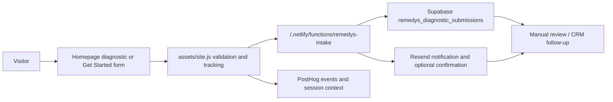

# Operations

How the Remedys.ai site is run: local dev, deploy, environment, and the launch/QA
checklist. The site is live — treat this as the standing operational reference, not a
one-time pre-launch gate. (Originated as the May 2026 launch-wiring checklist.)

## Local development

```sh
npx serve -l 4500 .
```

Serves the static root at `http://localhost:4500` (matches `.claude/launch.json`).
No build step. Edit route HTML and/or the shared `assets/`, then refresh.

## Deploy

- **Automatic:** push to `main` → Netlify auto-deploys. `netlify.toml` sets
  `publish = "."`, with no build command and no redirects.
- **Manual:** `npx netlify-cli deploy --prod --dir=.`
- **Production:** https://remedys.ai

## Homepage V10 QA

- [ ] Header has a horizontal divider and no vertical rails inside the header.
- [ ] Page rails begin below the header.
- [ ] Hero uses `AI-native product studio`, `Put AI to work.`, and the approved homepage body.
- [ ] Hero body sits as two balanced lines on common desktop widths when the viewport allows.
- [ ] Services and diagnostic intro copy use inner gutters inside the rails.
- [ ] Diagnostic terminal is full-width inside the rail and has no OS-style red/yellow/green dots.
- [ ] Diagnostic terminal has no decorative underscore cursor.
- [ ] `Start the Diagnostic` focuses the terminal input.
- [ ] Enter key and `Enter` button both submit diagnostic answers.
- [ ] Seven diagnostic questions complete and produce a recommendation result.
- [ ] Recommendation submission reaches the Netlify intake function.
- [ ] Mobile layout has no overlapping text, clipped buttons, or unusable terminal input.

## Intake Architecture



The browser never writes directly to Supabase. All lead capture goes through the Netlify function.

## Required Environment Variables

Netlify function:

- `SUPABASE_URL`
- `SUPABASE_SECRET_KEY` or `SUPABASE_SERVICE_ROLE_KEY`
- `LEAD_IP_HASH_SECRET`
- `ALLOWED_ORIGINS`
- `INTRO_CALL_BOOKING_URL`
- `RESEND_API_KEY`
- `RESEND_FROM`
- `LEAD_NOTIFY_TO`
- `SEND_LEAD_CONFIRMATION`

Client analytics:

- PostHog project key
- PostHog host
- Optional flag/config values for session replay masking and autocapture behavior

Production values:

- `ALLOWED_ORIGINS` should include `https://remedys.ai` and `https://www.remedys.ai`
- `RESEND_FROM` should use a verified Remedys sender/domain
- `INTRO_CALL_BOOKING_URL` should point to the approved booking calendar

## Supabase Requirements

Database migrations (all applied on disk):

- `supabase/migrations/20260515120000_create_remedys_intake.sql`
- `supabase/migrations/20260515133000_harden_remedys_intake.sql`
- `supabase/migrations/20260519100000_align_remedys_intake_schema.sql`
- `supabase/migrations/20260519143000_diagnostic_v3_plain_7.sql` — first-class v3 fields (the seven diagnostic answers, scoring/version fields, `path_scores`, `score_breakdown`, `recommendation_output`, booking reconciliation, lead key). **This already shipped**; older notes that call it "the next required migration" are stale.

Required table:

`public.remedys_diagnostic_submissions`

Required submission behavior:

- Store Diagnostic and Direct Request submissions as separate event rows.
- Support Diagnostic only, Direct Request only, Direct Call only, Diagnostic then Direct Request, Direct Request then Diagnostic, Diagnostic followed by booking, Direct Request followed by booking, both intake paths followed by booking, and returning visitors submitting later requests.
- Preserve source, submission ID, normalized work email, lead key, PostHog IDs, entry path, UTM/referrer context, diagnostic version, scoring version, path scores, score breakdown, recommendation output, and raw payload so related submissions can be reviewed together.
- Preserve booking email and calendar event ID when available so direct-call bookings can be reconciled even when no diagnostic or direct request came first.

Security requirements:

- RLS enabled on the intake table.
- `anon` and `authenticated` roles cannot select, insert, update, or delete intake rows directly.
- Service role key is server-only and never exposed to client JavaScript.
- IP addresses are stored only as HMAC hashes.
- Raw payload is stored for debugging, but avoid placing secrets or unnecessary sensitive data in the payload.
- Production test submissions should use `is_test = true` where possible.

## Resend Requirements

Required behavior:

- Notify the Remedys team on every valid direct request and diagnostic submission.
- Optionally send a confirmation email to the submitter when `SEND_LEAD_CONFIRMATION=true`.
- Use a verified `remedys.ai` sender before production.
- Keep email copy short, practical, and aligned with the approved success state.

Optional future behavior:

- Add Resend webhooks for delivered, bounced, complained, and failed events.
- Store email delivery status back into Supabase or a CRM once the CRM path is finalized.

## PostHog Requirements

Track the full funnel without collecting unnecessary sensitive data.

Recommended events:

- `cta_clicked`
- `diagnostic_started`
- `diagnostic_question_answered`
- `diagnostic_contact_submitted`
- `diagnostic_submitted`
- `diagnostic_recommendation_viewed`
- `diagnostic_book_call`
- `diagnostic_submit_request`
- `book_call_clicked`
- `direct_call_booking_started`
- `direct_request_started`
- `direct_request_submitted`
- `direct_request_submit_failed`
- `form_validation_error`

Recommended properties:

- `page_path`
- `form_variant`
- `source`
- `recommendation_key`
- `recommendation_label`
- `recommendation_band`
- `readiness_score`
- `can_book`
- `booking_path`
- `has_prior_intake`
- `direct_request_path`
- `utm_source`
- `utm_medium`
- `utm_campaign`

Privacy requirements:

- Do not send full free-text lead descriptions to PostHog.
- Mask form inputs and terminal text in session replay.
- Capture PostHog distinct/session IDs in Supabase only for lead-review context.
- Confirm cookie/banner and privacy policy handling before production if tracking goes beyond strictly necessary analytics.

## Netlify Function Requirements

The intake function must:

- Accept only `POST`.
- Accept only JSON.
- Enforce a payload size limit.
- Validate allowed origins.
- Keep local development origins working.
- Quietly accept honeypot submissions without storing them.
- Normalize email casing.
- Validate source, direct-call booking context, and direct request path values.
- Insert into Supabase using the server-side key.
- Return a booking URL only when the diagnostic is high-fit or when the flow is explicitly allowed to show it.

## Search, AEO, GEO, And Agent Discovery

> **Note:** `sitemap.xml`, `robots.txt`, and `llms.txt` do **not** currently exist in
> the repo root. The items below that reference them are aspirational until those files
> are created.

Before deploy:

- Confirm every route has a unique title and meta description.
- Confirm canonical URLs are production URLs.
- Confirm Open Graph and Twitter metadata are accurate.
- Confirm JSON-LD does not invent proof, pricing, reviews, ratings, or claims.
- Confirm `/sitemap.xml` includes all production routes.
- Confirm `/robots.txt` references sitemap and does not block important pages.
- Confirm `/llms.txt` reflects the current copy and route map.
- Confirm the homepage and service pages answer the basic questions: who Remedys helps, what Remedys does, how the process works, and how to get started.

## Manual QA

Run this before production deploy:

1. Open every route on desktop and mobile.
2. Click every CTA and confirm it routes correctly.
3. Complete the diagnostic with a high-fit score and confirm `Book a Call` appears.
4. Complete the diagnostic with a low-fit score and confirm the submit-request path appears.
5. Submit a direct request with the canonical `Not sure yet / Help me choose the right path.` option.
6. Test direct-call only: click `Book a Call` without completing Diagnostic or Direct Request first, then confirm booking context can be reconciled by email and source page.
7. Test the full path matrix: Diagnostic only, Direct Request only, Direct Call only, Diagnostic then Direct Request, Direct Request then Diagnostic, Diagnostic then booking, Direct Request then booking, both intake paths then booking, and returning visitor submits another request.
8. Confirm Supabase stores every expected field.
9. Confirm Resend sends the internal notification.
10. Confirm optional confirmation email behavior if enabled.
11. Confirm PostHog receives funnel events without sensitive free-text fields.
12. Confirm session replay masks form and terminal inputs.
13. Add newly discovered edge cases to this checklist during QA and retest them before production approval.

## Local Verification

Run:

```sh
node --check assets/site.js
node --check netlify/functions/remedys-intake.js
node --check scripts/verify-remedys-intake.js
node scripts/verify-remedys-intake.js
```

Stale-copy scan:

```sh
rg -n "Book a Free Intro Call|You're making the right move|We’ll review it|We'll review it|do not know where to start|Not sure yet &mdash; Help me choose|AI Consulting \\| Remedys|AI Engineering \\| Engineering" .
```

Expected result: no matches.

## Production Blockers

Do not ship until these are confirmed:

- Supabase migrations are applied in the production project.
- Netlify has all required env vars.
- Resend `remedys.ai` sender/domain is verified.
- PostHog project key and host are configured.
- Session replay masks sensitive inputs.
- The calendar URL is final.
- Live diagnostic and direct request submissions have been tested against the production deploy preview.
- `/llms.txt`, `/sitemap.xml`, `/robots.txt`, and route metadata are reviewed after final copy.
